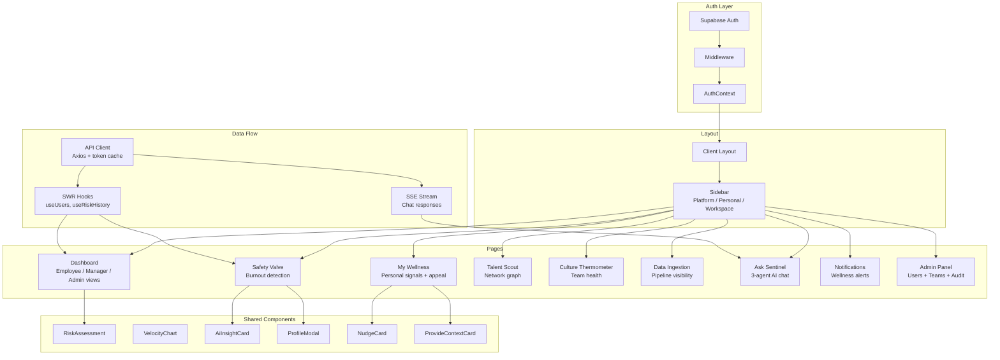

# Sentinel Frontend -- AI-Powered Employee Insights Dashboard

Privacy-first burnout detection, talent discovery, and team health monitoring. Built with Next.js 16, React 19, and a 3-agent AI orchestrator.

## Overview

Sentinel is an employee wellbeing analytics platform that detects burnout risk, surfaces hidden talent, and monitors team health through a hybrid model: metadata-first behavioral signals with optional consented sentiment. The frontend provides role-adaptive dashboards (Employee, Manager, Admin), real-time AI chat with tool execution, and a privacy-first design where employee identities are anonymized by default.

The platform is metadata-first for core risk scoring (timestamps, message counts, calendar density), and supports opt-in sentiment classification as a secondary signal. Raw text is never stored.

## Tech Stack

| Layer | Technology |
|-------|------------|
| Framework | Next.js 16.1 (App Router, Turbopack, standalone output) |
| UI Library | React 19.2, TypeScript 5 |
| Styling | Tailwind CSS v4, shadcn/ui, Radix UI primitives |
| Data Visualization | Recharts, D3.js (force-directed network graphs) |
| Animation | Framer Motion 12, GSAP 3, Rive (WebGL2) |
| State | React Context (auth, tenant), SWR (data fetching) |
| Auth | Supabase Auth via `@supabase/ssr` (HttpOnly cookie sessions) |
| AI Chat | SSE streaming with 3-agent orchestrator |
| Forms | React Hook Form + Zod validation |
| Tables | TanStack Table v8 |
| Node Graphs | React Flow (`@xyflow/react`) |
| Markdown | react-markdown + remark-gfm + Shiki syntax highlighting |

## Features

### Three Analysis Engines

- **Safety Valve** -- Burnout detection with velocity scoring, circadian entropy analysis, 30-day history charts, and attrition probability forecasting.
- **Talent Scout** -- Network centrality analysis (betweenness + eigenvector) with hidden gem detection and D3 force-directed social graph visualization.
- **Culture Thermometer** -- Team-level health monitoring with SIR contagion model, graph fragmentation metrics, and communication decay rate tracking.

### AI Chat (Ask Sentinel)

- 3-agent orchestrator (Gemini 2.5 Flash) with automatic agent routing
- SSE streaming with tool call visualization and OAuth connection links
- Composio MCP Tool Router for 250+ third-party integrations
- Session management with history, favorites, and search
- AI-generated 1:1 agenda suggestions with talking points

### Role-Based Access

| Role | Access |
|------|--------|
| Employee | Personal wellbeing dashboard, AI chat, privacy controls, GDPR consent management |
| Manager | All engines, team analytics, data ingestion, employee risk views |
| Admin | Full access, member/team management, audit log, simulation controls, tenant management |

### Privacy Architecture

- **Two-vault system**: Behavioral metadata and identity stored separately
- **Anonymized by default**: Employee hashes shown in all views; real names revealed only for CRITICAL risk levels
- **Opt-in sentiment**: Text analysis requires explicit consent; raw text is never stored
- **GDPR controls**: Employees can pause monitoring, revoke consent, and view their audit trail
- **Context enrichment**: Employees can explain anomalous patterns (e.g., "working late due to product launch") to prevent false positives

## External APIs and Setup

### Required Services

| Service | Purpose | Setup |
|---------|---------|-------|
| **Supabase** | Authentication and session management (JWT + HttpOnly cookies) | Create a free project at [supabase.com](https://supabase.com). Copy the project URL and anon key from Settings > API. |
| **Sentinel Backend** | All data, AI chat, engine analysis, tool connections | Run the FastAPI backend on port 8000. See `backend/README.md` for setup. |

### Optional Services (via Backend)

These services are configured on the backend. The frontend does not call them directly.

| Service | Purpose |
|---------|---------|
| Google Gemini 2.5 Flash | AI chat orchestrator (3-agent system) |
| Composio | MCP Tool Router for third-party integrations (Slack, GitHub, Gmail, etc.) |

### Environment Variables

Create a `.env.local` file in the `frontend/` directory:

```env
# Supabase Auth (required)
# Get these from your Supabase project: Settings > API
NEXT_PUBLIC_SUPABASE_URL=https://your-project.supabase.co
NEXT_PUBLIC_SUPABASE_ANON_KEY=eyJ...your-anon-key

# Backend API (required)
# Points to the FastAPI backend -- no trailing slash
NEXT_PUBLIC_API_URL=http://localhost:8000/api/v1

# WebSocket (required for real-time events)
NEXT_PUBLIC_WS_URL=ws://localhost:8000/ws
```

Both `NEXT_PUBLIC_SUPABASE_*` variables are validated at runtime. The app throws on startup if either is missing.

See `.env.example` for a copy-paste template with placeholder values.

## Setup and Installation

### Prerequisites

- Node.js 20+
- pnpm 9+ (`corepack enable pnpm` or `npm install -g pnpm`)
- A running Sentinel backend (see `backend/README.md`)
- A Supabase project with email auth enabled

### Quick Start

```bash
# Clone the repository
git clone https://github.com/MohitGoyal09/Sentinel-frontend.git
cd Sentinel-frontend

# Install dependencies
pnpm install

# Create your environment file
cp .env.example .env.local
# Edit .env.local with your Supabase credentials and backend URL

# Start the development server (Turbopack)
pnpm dev
```

Open [http://localhost:3000](http://localhost:3000). You should see the login page.

### Demo Credentials

Seeded by `python -m scripts.demo_seed` on the backend. The shared password is set via `SEED_PASSWORD` in `backend/.env`.

| Email | Role |
|-------|------|
| `admin@demo.sentinel` | Admin |
| `manager@demo.sentinel` | Manager |
| `employee@demo.sentinel` | Employee |

### Production Build

```bash
pnpm build   # Type-checks and builds for production
pnpm start   # Starts the production server on port 3000
```

## Docker

The project includes a multi-stage Dockerfile optimized for production (Node 20 Alpine, standalone output, non-root user, health check).

### Build and Run

```bash
# Build the image
docker build -t sentinel-frontend .

# Run with environment variables
docker run -p 3000:3000 \
  -e NEXT_PUBLIC_SUPABASE_URL=https://your-project.supabase.co \
  -e NEXT_PUBLIC_SUPABASE_ANON_KEY=your-anon-key \
  -e NEXT_PUBLIC_API_URL=http://backend:8000/api/v1 \
  -e NEXT_PUBLIC_WS_URL=ws://backend:8000/ws \
  sentinel-frontend
```

### Build Stages

The Dockerfile uses three stages for a minimal production image (~150MB):

1. **deps** -- Installs dependencies with `pnpm install --frozen-lockfile`
2. **builder** -- Builds the Next.js app with `pnpm build` (standalone output mode)
3. **runner** -- Production image with non-root `nextjs` user (UID 1001) and a `wget`-based health check on port 3000

### Health Check

The container includes a built-in health check:

```
HEALTHCHECK --interval=30s --timeout=10s --start-period=30s --retries=5
    CMD wget --no-verbose --tries=1 --spider http://localhost:3000/ || exit 1
```

## Architecture

### Component Hierarchy



## Architecture Decisions

### 1. App Router with Server/Client Component Split

All pages use the Next.js App Router. The root layout (`app/layout.tsx`) is a server component that renders `AuthProvider`, `TenantProvider`, and `ThemeProvider` as client boundaries. Individual page content is wrapped in `<ProtectedRoute>` and `<RoleGuard>` for access control.

### 2. Supabase SSR for HttpOnly Cookie Auth

Authentication uses `@supabase/ssr` with `createServerClient` in middleware and `createClient` on the client. Tokens are stored in HttpOnly cookies (not localStorage), with automatic refresh and chunked cookie support for large JWTs.

### 3. Four-Layer Security Model

1. **Next.js middleware** (`middleware.ts`) -- Redirects unauthenticated requests to `/login`
2. **ProtectedRoute component** -- Client-side guard wrapping all authenticated pages
3. **Backend JWT verification** -- Every API request includes `Authorization: Bearer <token>`
4. **RBAC enforcement** -- 52 permissions enforced on the backend; `role` from `AuthContext` controls UI visibility

### 4. SSE Streaming for AI Chat (Not WebSocket)

The AI chat uses Server-Sent Events (`POST /ai/chat/stream`) instead of WebSocket for streaming responses. SSE is simpler to deploy behind load balancers, works through CDNs without special configuration, and naturally fits the request-response pattern of chat. The stream carries typed events: `token`, `tool_call`, `connection_link`, `refusal`, `workflow`, and `done`.

### 5. Privacy-First Data Display

Employee hashes (`user_hash`) are the default identifier in all views. Real names (`display_name`) are fetched from the backend profile only for Admin views and CRITICAL risk escalations. The `Connection Index` remains the primary engagement signal, while opt-in sentiment acts as a secondary confirmation layer.

### 6. Cached Access Token Pattern

The API module (`lib/api.ts`) caches the Supabase access token in a module-level variable (`setCachedAccessToken`), set by the `AuthProvider` on every auth state change. This avoids calling `supabase.auth.getSession()` on every API request, which can fail when the refresh token is invalid even though the access token is still valid.

### 7. Content Security Policy

The `next.config.ts` sets a strict CSP including `Strict-Transport-Security`, `X-Frame-Options: DENY`, and `Permissions-Policy`. The CSP whitelists `*.supabase.co` for auth, `*.composio.dev` for OAuth flows, and blocks all other frames.

## Design System

### Aesthetic Direction

Industrial/utilitarian with warmth. Information-dense but not overwhelming. Dark mode is the primary theme; light mode is supported via `next-themes`.

**References**: Lattice (HR warmth) meets Linear (data clarity). Never surveillance software (Teramind), never generic AI dashboards (purple gradients).

### Color

| Token | Value | Usage |
|-------|-------|-------|
| `primary` | `#10B981` (Emerald) | Single accent color -- primary actions, active states |
| `--risk-low` | `#22C55E` | LOW risk badge |
| `--risk-elevated` | `#F59E0B` | ELEVATED risk badge |
| `--risk-critical` | `#EF4444` | CRITICAL risk badge |

Grayscale dominates. Color is rare and meaningful.

### Typography

| Role | Size | Font |
|------|------|------|
| Display / Hero | 24px | Geist Sans, `font-semibold` |
| Body | 14px | Geist Sans, `font-normal` |
| UI Labels | 11px | Geist Sans, `font-medium uppercase tracking-wider` |
| KPI Values | 28px | Geist Sans, `font-semibold tabular-nums` |
| Code / Data | 13px | Geist Mono |
| Headings (accent) | Variable | Playfair Display (serif) |

Fonts are loaded via the `geist` npm package and `next/font/google`, injected as CSS variables in `app/layout.tsx`.

See `.impeccable.md` for the full design context and principles.

## Project Structure

```
frontend/
├── app/                    # Next.js App Router pages
│   ├── admin/              # Admin panel (Members, Teams, Audit)
│   ├── ask-sentinel/       # AI chat + session history
│   ├── dashboard/          # Role-adaptive main dashboard
│   ├── data-ingestion/     # CSV upload + pipeline status
│   ├── engines/
│   │   ├── safety/         # Safety Valve -- burnout detection
│   │   ├── talent/         # Talent Scout -- network analysis
│   │   ├── culture/        # Culture Thermometer -- team health
│   │   └── network/        # Interactive D3 social graph
│   ├── login/              # Auth page (email + SSO)
│   ├── marketplace/        # Composio tool connections
│   ├── me/                 # Employee self-service (consent, GDPR)
│   ├── notifications/      # Real-time wellness alerts
│   ├── simulation/         # Digital twin demo controls
│   └── layout.tsx          # Root layout (providers, fonts)
├── components/
│   ├── chat/               # SSE streaming interface, tool cards
│   ├── dashboard/          # Stat cards, risk meters, charts
│   ├── layout/             # Sidebar, header, client layout
│   ├── tools/              # Marketplace tool cards
│   ├── ui/                 # shadcn/ui primitives
│   └── *.tsx               # Feature components (network graph, etc.)
├── contexts/
│   ├── auth-context.tsx    # Supabase auth state + role fetching
│   └── tenant-context.tsx  # Multi-tenant context
├── hooks/                  # Domain hooks (useRiskData, useNetworkData, etc.)
├── lib/
│   ├── api.ts              # Axios-based API client with auth headers
│   ├── supabase.ts         # Supabase client factory
│   ├── sso.ts              # SSO configuration
│   └── utils.ts            # Shared utilities (cn, formatters)
├── types/                  # TypeScript type definitions
├── middleware.ts           # Auth middleware (Supabase SSR)
├── next.config.ts          # Standalone output, CSP headers, security
├── Dockerfile              # Multi-stage production build
└── .env.example            # Environment variable template
```

## Pages and Routes

| Route | Page | Access |
|-------|------|--------|
| `/login` | Login (email + SSO) | Public |
| `/dashboard` | Role-adaptive dashboard | All authenticated |
| `/ask-sentinel` | AI chat with 3-agent orchestrator | All authenticated |
| `/ask-sentinel/history` | Chat session history | All authenticated |
| `/engines/safety` | Safety Valve -- burnout detection | Manager, Admin |
| `/engines/talent` | Talent Scout -- network analysis | Manager, Admin |
| `/engines/culture` | Culture Thermometer -- team health | Manager, Admin |
| `/engines/network` | Interactive D3 social graph | Manager, Admin |
| `/admin` | Admin panel (Members / Teams / Audit tabs) | Admin only |
| `/notifications` | Notification center | All authenticated |
| `/data-ingestion` | CSV upload + pipeline status | Manager, Admin |
| `/marketplace` | Tool connections (Composio) | All authenticated |
| `/me` | Employee self-service (consent, GDPR) | All authenticated |
| `/simulation` | Digital twin demo controls | Admin |

## Testing

```bash
# Type checking
npx tsc --noEmit

# Linting
pnpm lint

# Production build (includes type check)
pnpm build
```

## Troubleshooting

**CORS errors on API calls**
The backend `ALLOWED_ORIGINS` must include `http://localhost:3000`. Check `backend/.env`.

**Stale TypeScript errors in `.next/types`**

```bash
rm -rf .next/types && pnpm dev
```

**Missing `NEXT_PUBLIC_SUPABASE_URL` on startup**
Verify `.env.local` is in the `frontend/` directory (not the repo root) and that both variable names include the `NEXT_PUBLIC_` prefix.

**Login succeeds but all pages redirect back to `/login`**
The `JWT_SECRET` in `backend/.env` must match the JWT secret in your Supabase project (Settings > API > JWT Settings).

**Docker build fails on `pnpm-lock.yaml` not found**
Ensure `pnpm-lock.yaml` exists. Run `pnpm install` locally first to generate it.

## Further Reading

- `.impeccable.md` -- Full design system context and principles
- `backend/README.md` -- Backend setup, API documentation, agent architecture
